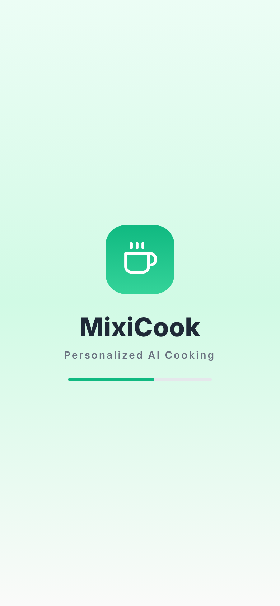
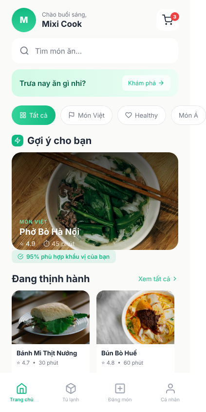
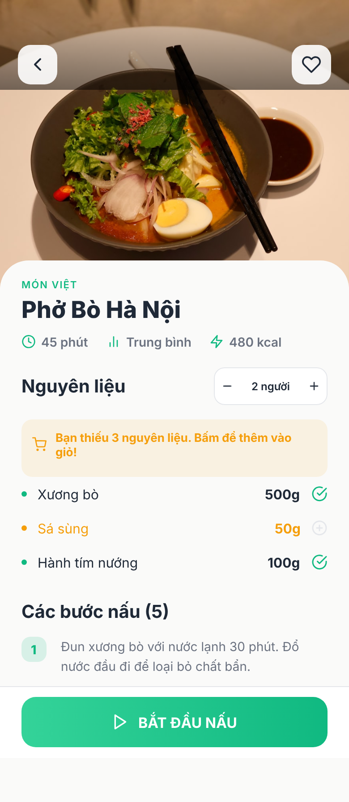
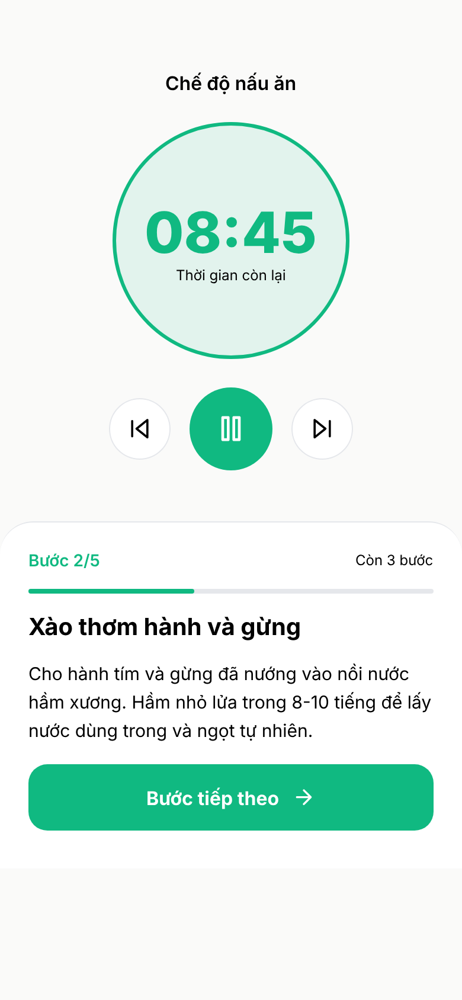
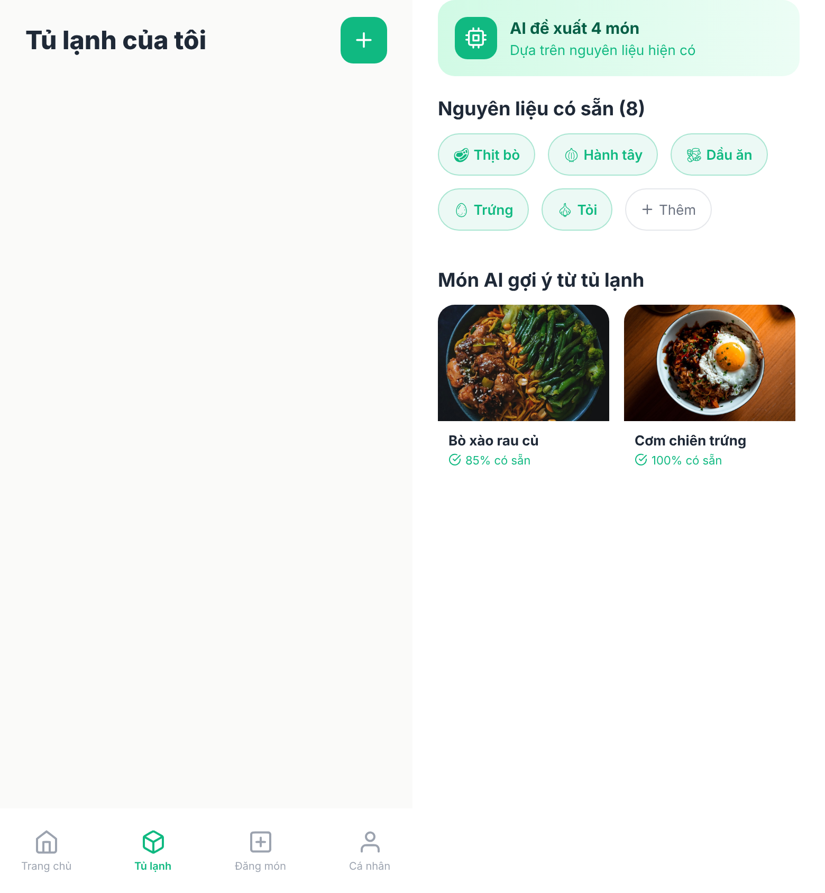
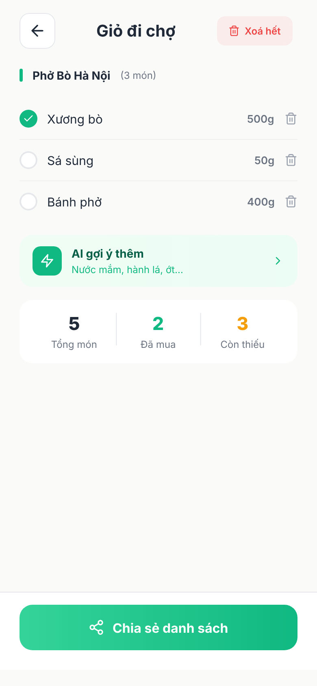
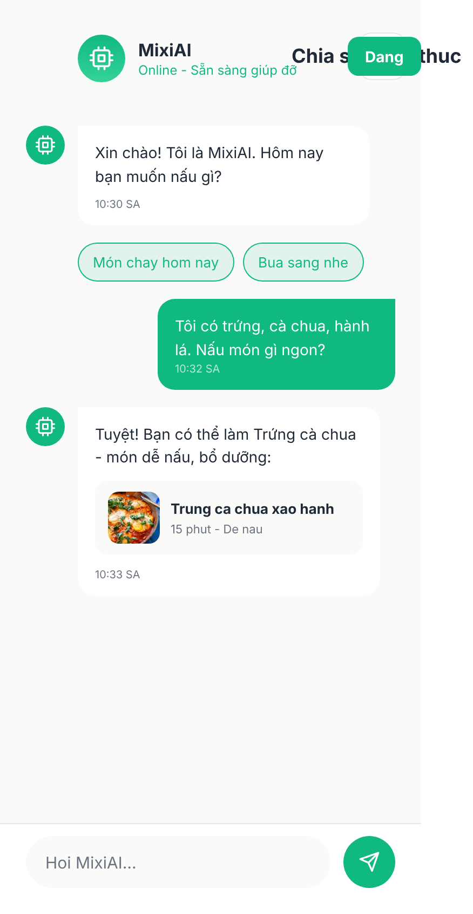
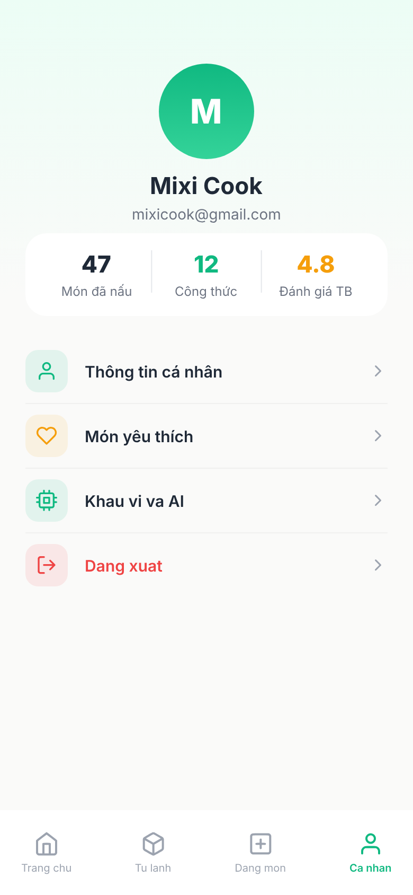

# MixiCook - Ứng dụng Gợi ý Công thức Nấu ăn

## 1. Tên đề tài

**MixiCook** - Ứng dụng gợi ý công thức nấu ăn thông minh dựa trên nguyên liệu có sẵn.

## 2. Giới thiệu hệ thống

**MixiCook** là một ứng dụng di động được thiết kế để giải quyết bài toán "Hôm nay ăn gì?" cho người dùng. Bằng cách nhập vào những nguyên liệu đang có sẵn trong tủ lạnh, hệ thống sẽ đề xuất các món ăn phù hợp nhất. Đồng thời, ứng dụng còn tích hợp các tính năng thông minh giúp tối ưu hóa trải nghiệm nấu nướng:

- **Quản lý tủ lạnh & Giỏ hàng thông minh**: Tự động tính toán nguyên liệu còn thiếu và thêm vào giỏ đi chợ.
- **Chế độ nấu ăn (Cooking Mode)**: Hướng dẫn từng bước nấu ăn với giao diện rảnh tay và đồng hồ bấm giờ (Timer).
- **Chia sẻ công thức**: Cộng đồng người dùng có thể tự đăng tải và chia sẻ công thức của riêng mình.

## 3. Danh sách thành viên và MSSV

- Nguyễn Hồng Đăng - 23810310039
- Đàm Đức Huy - 23810310051

## 4. Phân công nhiệm vụ cụ thể

### **Nguyễn Hồng Đăng (23810310039)**

Thiết kế và lập trình các giao diện & chức năng:

- `SplashScreen`: Màn hình khởi động ứng dụng.
- `FridgeScreen`: Quản lý tủ lạnh và nguyên liệu hiện có.
- `IngredientPickerScreen`: Chọn nguyên liệu nhanh chóng.
- `PostRecipeScreen`: Đăng tải công thức nấu ăn mới.
- `RecipeDetailScreen`: Xem chi tiết nguyên liệu và các bước làm món ăn.
- `SearchResultScreen`: Kết quả tìm kiếm và bộ lọc thông minh.
- `ShoppingCartScreen`: Quản lý giỏ hàng đi chợ.

### **Đàm Đức Huy (23810310051)**

Thiết kế và lập trình các giao diện & chức năng:

- `LoginScreen`: Đăng nhập hệ thống.
- `RegisterScreen`: Đăng ký tài khoản mới.
- `ForgotPasswordScreen`: Khôi phục mật khẩu.
- `OTPScreen`: Xác thực mã OTP.
- `CookingScreen` (Cooking Mode): Giao diện hướng dẫn nấu ăn từng bước.
- `ProfileScreen`: Trang thông tin cá nhân và thống kê.
- `HomeScreen`: Trang chủ hiển thị danh sách công thức thịnh hành và đề xuất.

## 5. Công nghệ sử dụng

- **Front-end**: React Native, Expo.
- **State Management**: Zustand.
- **Thiết kế UI/UX**: Figma.

## 6. Hướng dẫn cài đặt

Yêu cầu hệ thống: Đã cài đặt [Node.js](https://nodejs.org/) và ứng dụng Expo Go trên điện thoại (nếu chạy trên máy thật).

1. Clone repository về máy:
   ```bash
   git clone https://github.com/imprairies26/MixiCook.git -b beside
   cd MixiCook/product
   ```
2. Cài đặt các package và thư viện phụ thuộc:
   ```bash
   npm install expo@54.0.33
   npx expo install
   ```

## 7. Hướng dẫn chạy project

1. Khởi động Expo Server:
   ```bash
   npx expo start -c
   ```
2. **Trên máy ảo (Simulator/Emulator)**: Nhấn phím `i` để mở iOS Simulator hoặc phím `a` để mở Android Emulator trên Terminal.
3. **Trên máy thật**: Tải ứng dụng **Expo Go** trên iOS/Android và quét mã QR hiển thị trên Terminal.

## 8. Tài khoản demo (nếu có)

- **Email**: `admin@mixicook.com`
- **Mật khẩu**: `123`

## 9. Hình ảnh minh họa hệ thống

Dưới đây là một số giao diện nổi bật của ứng dụng:

<div align="center">
  
  
  
  
</div>
<div align="center">
  
  
  
  
</div>

## 10. Link video demo

**Video Hướng dẫn & Demo**: [https://drive.google.com/file/d/1-YPNxb5QB6VVt_3nxJsbRQsc3MKWd331/view?usp=sharing]

## 11. Link Figma

**Figma**: [https://www.figma.com/design/h8l7MlX4S4AGIXTvxsgYxL/Figma-basics?node-id=1669-162202&p=f&t=PbWDpyxIJd5KLvHA-0]