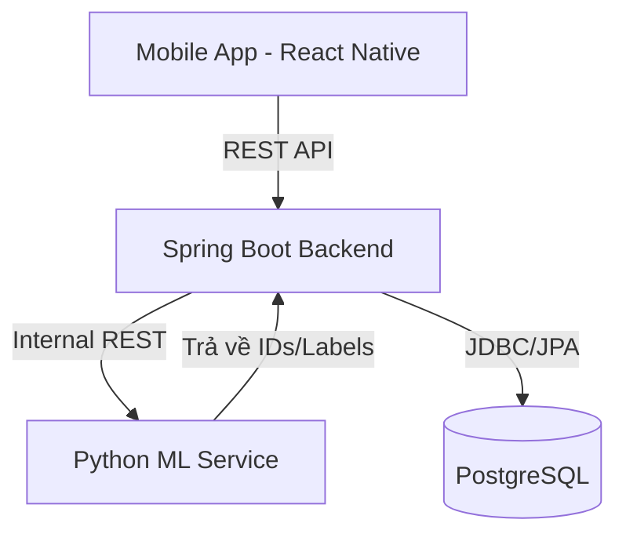
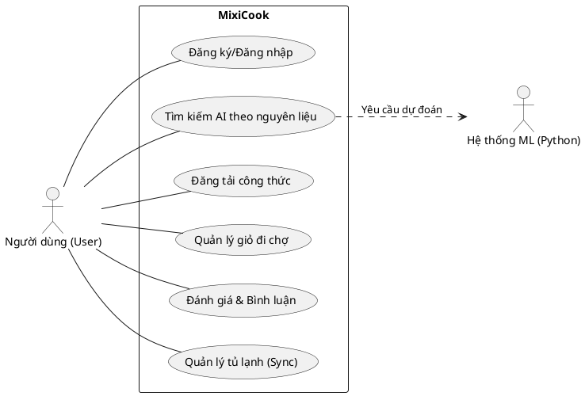
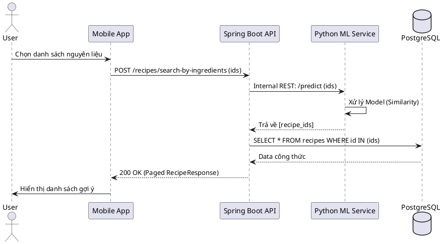
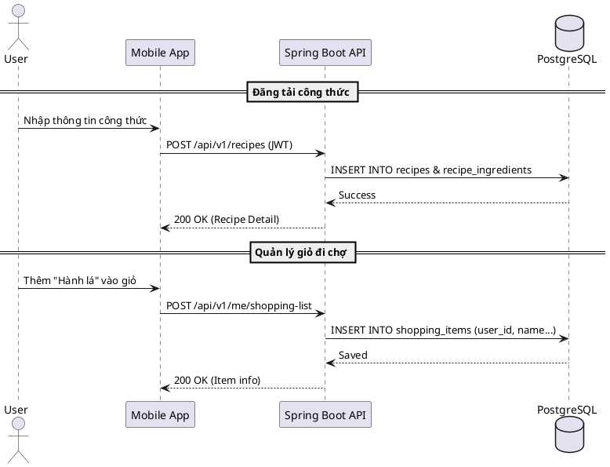
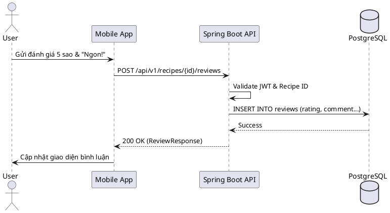

# MixiCook Backend Design Report

Bản báo cáo chi tiết về thiết kế kiến trúc hệ thống và cơ sở dữ liệu cho ứng dụng MixiCook.

## 1. Công nghệ sử dụng (Tech Stack)
- **Main Backend:** Java 17, Spring Boot 3.5.13.
- **Database:** PostgreSQL.
- **ML Search Service:** Python (FastAPI/Flask).
- **Giao tiếp:** REST API (Synchronous - Hybrid approach).
- **Xác thực:** JWT (JSON Web Token).

## 2. Kiến trúc Hệ thống (System Architecture)

Hệ thống được thiết kế theo mô hình Microservices đơn giản, tập trung vào khả năng tích hợp linh hoạt giữa Java và Python.



### Luồng xử lý tìm kiếm theo nguyên liệu:
1. **Mobile App:** Người dùng chọn danh sách nguyên liệu từ `IngredientPickerScreen`.
2. **Spring Boot:** Nhận mảng `ingredient_ids`, thực hiện xác thực và gọi đến `ML Search Service`.
3. **Python Service:** Nhận đầu vào, đưa vào model học máy để tính toán độ tương đồng/phù hợp và trả về một danh sách các `recipe_ids`.
4. **Spring Boot:** Dùng danh sách `recipe_ids` nhận được để query thông tin chi tiết (tên, ảnh, mô tả) từ PostgreSQL và trả về cho Mobile.

## 3. Thiết kế Cơ sở dữ liệu (Database Schema)

Hệ thống sử dụng PostgreSQL với các thực thể chính sau:

### Bảng `users`
Lưu trữ thông tin người dùng và phân quyền.
- `id` (UUID, PK)
- `username` (Varchar, Unique)
- `password` (Varchar)
- `email` (Varchar, Unique)
- `avatar_url` (Text)
- `created_at` (Timestamp)

### Bảng `ingredients` (Hệ thống quản lý)
Danh mục nguyên liệu chuẩn của hệ thống để người dùng chọn.
- `id` (Long, PK)
- `name` (Varchar, Unique)
- `category` (Varchar): Rau củ, thịt, gia vị...
- `image_url` (Text)

### Bảng `recipes`
Lưu trữ công thức nấu ăn. Bao gồm cả dữ liệu mẫu của hệ thống và dữ liệu người dùng đóng góp.
- `id` (Long, PK)
- `title` (Varchar)
- `description` (Text)
- `instructions` (Text/JSON): Các bước thực hiện.
- `image_url` (Text)
- `cooking_time` (Integer): Phút.
- `difficulty` (Enum): Easy, Medium, Hard.
- `user_id` (UUID, FK): Null nếu là công thức mặc định của hệ thống.
- `is_system` (Boolean): Đánh dấu công thức gốc.
- `created_at` (Timestamp)

### Bảng `recipe_ingredients` (Mapping)
Liên kết nguyên liệu vào công thức.
- `recipe_id` (Long, FK)
- `ingredient_id` (Long, FK)
- `amount` (Float): Số lượng.
- `unit` (Varchar): gram, cái, thìa...

### Bảng `saved_recipes`
Lưu trữ danh sách công thức người dùng đã lưu (Favorites).
- `id` (Long, PK)
- `user_id` (UUID, FK)
- `recipe_id` (Long, FK)
- `saved_at` (Timestamp)
- *Constraint:* Unique(user_id, recipe_id) để tránh lưu trùng lặp.

### Bảng `reviews` (Mới)
Lưu trữ đánh giá và bình luận của người dùng.
- `id` (Long, PK)
- `user_id` (UUID, FK)
- `recipe_id` (Long, FK)
- `rating` (Integer): 1-5 sao.
- `comment` (Text)
- `image_url` (Text): Ảnh đính kèm đánh giá.
- `created_at` (Timestamp)

### Bảng `user_ingredients` (Mới - Tủ lạnh)
Lưu trữ nguyên liệu người dùng đang có.
- `user_id` (UUID, PK, FK)
- `ingredient_id` (Long, PK, FK)
- `updated_at` (Timestamp)

### Bảng `shopping_items` (Mới - Giỏ đi chợ)
- `id` (Long, PK)
- `user_id` (UUID, FK)
- `name` (Varchar): Tên nguyên liệu.
- `amount` (Float)
- `unit` (Varchar)
- `is_checked` (Boolean)
- `created_at` (Timestamp)

## 4. Thiết kế chi tiết REST API (API Design)

Hệ thống tuân thủ nguyên tắc RESTful, sử dụng JSON làm định dạng trao đổi dữ liệu và hỗ trợ Versioning (`/api/v1`).

### 4.1. Authentication Resource
| Method | Endpoint | Description | Auth |
| :--- | :--- | :--- | :--- |
| POST | `/api/v1/auth/register` | Đăng ký tài khoản mới | Public |
| POST | `/api/v1/auth/login` | Đăng nhập và nhận JWT | Public |
| GET | `/api/v1/auth/me` | Lấy thông tin người dùng hiện tại | JWT |
| PUT | `/api/v1/auth/profile` | Cập nhật thông tin cá nhân | JWT |
| POST | `/api/v1/auth/forgot-password` | Yêu cầu mã OTP khôi phục mật khẩu | Public |
| POST | `/api/v1/auth/reset-password` | Xác thực OTP và đặt mật khẩu mới | Public |

### 4.2. Ingredient Resource
| Method | Endpoint | Description | Auth |
| :--- | :--- | :--- | :--- |
| GET | `/api/v1/ingredients` | Lấy danh sách nguyên liệu (hỗ trợ phân trang, lọc) | JWT |
| GET | `/api/v1/ingredients/categories` | Lấy danh sách các danh mục nguyên liệu | JWT |
| GET | `/api/v1/ingredients/{id}` | Chi tiết một nguyên liệu | JWT |

### 4.3. Recipe Resource
| Method | Endpoint | Description | Auth |
| :--- | :--- | :--- | :--- |
| GET | `/api/v1/recipes` | Danh sách công thức (mặc định, hot, tìm kiếm) | JWT |
| POST | `/api/v1/recipes` | Người dùng tạo công thức mới | JWT |
| GET | `/api/v1/recipes/{id}` | Chi tiết công thức | JWT |
| PUT | `/api/v1/recipes/{id}` | Cập nhật công thức (chủ sở hữu) | JWT |
| DELETE | `/api/v1/recipes/{id}` | Xóa công thức (chủ sở hữu) | JWT |
| GET | `/api/v1/recipes/my` | Danh sách công thức cá nhân | JWT |

### 4.4. Social & Interaction
| Method | Endpoint | Description | Auth |
| :--- | :--- | :--- | :--- |
| POST | `/api/v1/recipes/{id}/save` | Toggle lưu/bỏ lưu công thức | JWT |
| GET | `/api/v1/recipes/saved` | Lấy danh sách công thức đã lưu | JWT |
| GET | `/api/v1/recipes/{id}/reviews` | Lấy danh sách đánh giá của công thức | JWT |
| POST | `/api/v1/recipes/{id}/reviews` | Gửi đánh giá và bình luận mới | JWT |
| DELETE | `/api/v1/reviews/{reviewId}` | Xóa đánh giá (chủ sở hữu) | JWT |

### 4.5. User Personal State (Sync)
| Method | Endpoint | Description | Auth |
| :--- | :--- | :--- | :--- |
| GET | `/api/v1/me/fridge` | Lấy danh sách nguyên liệu trong tủ lạnh | JWT |
| PUT | `/api/v1/me/fridge` | Cập nhật/Đồng bộ danh sách tủ lạnh | JWT |
| GET | `/api/v1/me/shopping-list` | Lấy danh sách đi chợ | JWT |
| POST | `/api/v1/me/shopping-list` | Thêm nguyên liệu vào danh sách đi chợ | JWT |
| PATCH | `/api/v1/me/shopping-list/{itemId}` | Cập nhật trạng thái (checked) hoặc số lượng | JWT |
| DELETE | `/api/v1/me/shopping-list/{itemId}` | Xóa mục khỏi danh sách | JWT |
| DELETE | `/api/v1/me/shopping-list` | Xóa sạch giỏ đi chợ | JWT |

### 4.6. Discovery & AI Search
| Method | Endpoint | Description | Auth |
| :--- | :--- | :--- | :--- |
| POST | `/api/v1/recipes/search-by-ingredients` | Tìm kiếm AI dựa trên nguyên liệu | JWT |

### 4.5. Chuẩn hóa dữ liệu (Data Standards)

**Định dạng Phân trang (Pagination):**
Tất cả các API trả về danh sách đều sử dụng cấu trúc:
```json
{
  "content": [...],
  "page": 0,
  "size": 20,
  "total_elements": 100,
  "total_pages": 5
}
```

**Định dạng Lỗi (Error Handling):**
Sử dụng chuẩn HTTP Status Codes và Body lỗi thống nhất:
- `200/201`: Success
- `400`: Bad Request (Validation failed)
- `401/403`: Unauthorized/Forbidden
- `404`: Not Found
- `500`: Internal Server Error

```json
{
  "timestamp": "2026-04-23T10:00:00Z",
  "status": 400,
  "error": "Bad Request",
  "message": "Danh sách nguyên liệu không được để trống",
  "path": "/api/v1/recipes/search-by-ingredients"
}
```

## 5. Nhật ký quyết định (Decision Log)

| Vấn đề | Quyết định | Lý do |
| :--- | :--- | :--- |
| Phiên bản Framework | Spring Boot 3.5.13 | Sử dụng bản cập nhật hiện đại nhất năm 2026. |
| Quản lý nguyên liệu | Transient (không lưu DB khi chọn) | Tối ưu hóa Database, chỉ quản lý trạng thái tại Mobile cho đến khi tìm kiếm. |
| Cơ chế đóng góp | Pick từ nguyên liệu hệ thống | Đảm bảo dữ liệu nguyên liệu đồng nhất cho model ML, tránh việc người dùng nhập sai tên nguyên liệu. |
| Mô hình ML | Hybrid (Engine only) | Tách biệt rạch ròi: Python xử lý toán học, Java xử lý dữ liệu và nghiệp vụ. |
| Công thức đã lưu | Danh sách phẳng (Option A) | Đơn giản hóa trải nghiệm người dùng và Database trong giai đoạn quy mô nhỏ/vừa. |
| Cấu trúc Source Code | Layered Architecture | Phân chia theo Controller, Service, Repository, Entity giúp dễ quản lý và tiếp cận. |
| Chuyển đổi dữ liệu | Thủ công (Manual Mapping) | Tự kiểm soát logic ánh xạ giữa Entity và DTO mà không cần thư viện bên thứ ba. |

## 6. Thiết kế cấu trúc dự án Spring Boot

Root Package: `com.kenato.mixicook`

```text
src/main/java/com/kenato/mixicook/
├── MixiCookApplication.java   # Main entry point
├── config/                    # Spring Security, JWT, CORS, Web Config
├── controller/                # REST API Endpoints
│   ├── AuthController.java
│   ├── RecipeController.java
│   └── IngredientController.java
├── service/                   # Business Logic Interfaces
│   ├── AuthService.java
│   ├── RecipeService.java
│   ├── IngredientService.java
│   ├── MLSearchService.java   # Giao tiếp với Python Engine
│   └── impl/                  # Business Logic Implementations
│       ├── AuthServiceImpl.java
│       └── ...
├── repository/                # Spring Data JPA Repositories
│   ├── UserRepository.java
│   ├── RecipeRepository.java
│   └── ...
├── entity/                    # JPA Entities (PostgreSQL mapping)
│   ├── User.java
│   ├── Recipe.java
│   ├── Ingredient.java
│   └── SavedRecipe.java
├── dto/                       # Data Transfer Objects
│   ├── request/               # UserRequest, RecipeRequest...
│   └── response/              # UserResponse, RecipeResponse...
├── exception/                 # Global Exception Handling
│   ├── GlobalExceptionHandler.java
│   └── CustomException.java
├── security/                  # JWT Filters, UserDetails
│   ├── JwtTokenProvider.java
│   └── JwtAuthenticationFilter.java
└── utils/                     # Utility classes
    └── AppConstants.java
```

---
*Báo cáo được cập nhật bởi Gemini CLI Agent - 26/04/2026*

## 8. Kiểm thử và Xác thực (Testing & Verification)

Hệ thống đã được kiểm thử thông qua các Unit Test và Integration Test sử dụng framework JUnit 5 và MockMvc.

### 8.1. Kết quả Integration Test
Đã thực hiện 9 test case tích hợp cho các endpoint quan trọng nhất để đảm bảo tính ổn định của API (200 OK).

| Nhóm chức năng | Test Case | Trạng thái |
| :--- | :--- | :--- |
| **Authentication** | `login_ShouldReturn200` | ✅ PASSED |
| | `register_ShouldReturn200` | ✅ PASSED |
| **Ingredients** | `getAllIngredients_ShouldReturn200` | ✅ PASSED |
| | `getIngredientCategories_ShouldReturn200` | ✅ PASSED |
| **Recipes** | `getAllRecipes_ShouldReturn200` | ✅ PASSED |
| | `getRecipeById_ShouldReturn200` | ✅ PASSED |
| | `searchByIngredients_ShouldReturn200` | ✅ PASSED |
| **Personal State** | `getUserFridge_ShouldReturn200` | ✅ PASSED |
| | `getShoppingList_ShouldReturn200` | ✅ PASSED |

### 8.2. Đánh giá Code Review & API Design
Dựa trên tiêu chuẩn `api-design-principles` và `code-reviewer`:
- **API Design:** Cấu trúc RESTful chuẩn, hỗ trợ pagination và error response thống nhất. Bảo mật JWT được tích hợp xuyên suốt.
- **Logic:** Phân tách rõ ràng giữa Controller và Service. Các quyền sở hữu (owner-only) được kiểm tra kỹ lưỡng trước khi thực hiện các thao tác thay đổi dữ liệu (Update/Delete).
- **Database:** Mapping JPA chính xác với schema PostgreSQL. Dữ liệu mồi (seed data) đầy đủ cho việc phát triển và demo.

### 8.3. Nhật ký sửa lỗi (Debugging Report)

Trong quá trình kiểm thử bằng Postman, một số lỗi nghiêm trọng (500 Internal Server Error) đã được phát hiện và xử lý triệt để:

| Lỗi | Nguyên nhân | Giải pháp | Trạng thái |
| :--- | :--- | :--- | :--- |
| **ArrayList cannot be converted to String** | Kiểu dữ liệu `instructions` là `Object` gây nhầm lẫn cho Hibernate khi map vào cột `jsonb` trong PostgreSQL. | Đổi kiểu dữ liệu sang `List<String>` trong Entity và DTO để Jackson có thể Serialize/Deserialize chính xác. | ✅ FIXED |
| **NullPointerException (Delete/Update Recipe)** | Kiểm tra quyền sở hữu (`recipe.getUser().getId()`) bị lỗi khi thao tác với công thức hệ thống (`user_id = NULL`). | Thêm kiểm tra null-safe: `if (recipe.getUser() == null \|\| ...)` trước khi so sánh ID. | ✅ FIXED |

---
*Xác nhận bởi Gemini CLI Agent - 26/04/2026*

## 9. Biểu đồ hệ thống (PlantUML Diagrams)

Dưới đây là các đoạn mã PlantUML để vẽ biểu đồ Use Case và Sequence cho các chức năng chính.

### 9.1. Biểu đồ Use Case (Tổng quan)


### 9.2. Sequence Diagram: Tìm kiếm gợi ý AI


### 9.3. Sequence Diagram: Đăng tải công thức & Quản lý giỏ hàng


### 9.4. Sequence Diagram: Tương tác người dùng (Rating/Comment)


## 7. Hướng dẫn Test API chi tiết với Postman

Tài liệu này cung cấp các kịch bản kiểm thử chi tiết cho từng Resource. Sử dụng biến môi trường `base_url = http://localhost:8083` và `jwt_token`.

### 7.1. Authentication Resource
| API | Kịch bản | Method/URL | Body / Script | Kết quả kỳ vọng |
| :--- | :--- | :--- | :--- | :--- |
| **Đăng ký** | Thành công | `POST /api/v1/auth/register` | `{"username": "test_user", "email": "test@gmail.com", "password": "password123"}` | `200 OK` + JSON User |
| **Đăng ký** | Trùng email | `POST /api/v1/auth/register` | `{"username": "other", "email": "test@gmail.com", "password": "password"}` | `400 Bad Request` |
| **Đăng nhập** | Thành công | `POST /api/v1/auth/login` | **Script (Tests):** `pm.environment.set("jwt_token", pm.response.json().accessToken);` | `200 OK` + `accessToken` |
| **Lấy Profile** | Có Token | `GET /api/v1/auth/me` | **Header:** `Authorization: Bearer {{jwt_token}}` | `200 OK` |
| **Lấy Profile** | Không Token | `GET /api/v1/auth/me` | **Header:** (None) | `401 Unauthorized` |

### 7.2. Ingredient Resource
| API | Kịch bản | Method/URL | Params | Kết quả kỳ vọng |
| :--- | :--- | :--- | :--- | :--- |
| **Danh sách** | Tất cả | `GET /api/v1/ingredients` | `page=0&size=20` | `200 OK` + Paged List |
| **Lọc Category** | Rau củ | `GET /api/v1/ingredients` | `category=Rau củ` | `200 OK` (Chỉ Rau củ) |
| **Danh mục** | Lấy unique | `GET /api/v1/ingredients/categories` | (None) | `200 OK` + String Array |
| **Chi tiết** | Thành công | `GET /api/v1/ingredients/1` | (None) | `200 OK` |

### 7.3. Recipe Resource
| API | Kịch bản | Method/URL | Body / Params | Kết quả kỳ vọng |
| :--- | :--- | :--- | :--- | :--- |
| **Tạo mới** | Thành công | `POST /api/v1/recipes` | `{"title": "Món mới", "instructions": ["B1", "B2"], "ingredients": [{"ingredientId": 1, "amount": 100, "unit": "g"}]}` | `200 OK` + Recipe detail |
| **Xóa** | Không phải chủ | `DELETE /api/v1/recipes/1` | (Công thức của hệ thống) | `403 Forbidden` |
| **Lưu/Bỏ lưu** | Toggle | `POST /api/v1/recipes/1/save` | (None) | `200 OK` |
| **AI Search** | Theo nguyên liệu | `POST /api/v1/recipes/search-by-ingredients` | `{"ingredientIds": [1, 2, 6]}` | `200 OK` + Paged List |

### 7.4. User State (Fridge & Shopping)
| API | Kịch bản | Method/URL | Body | Kết quả kỳ vọng |
| :--- | :--- | :--- | :--- | :--- |
| **Đồng bộ tủ lạnh** | Ghi đè list | `PUT /api/v1/me/fridge` | `[1, 5, 10]` | `200 OK` |
| **Lấy tủ lạnh** | Thành công | `GET /api/v1/me/fridge` | (None) | `200 OK` + List Ingredient |
| **Giỏ đi chợ** | Thêm mục | `POST /api/v1/me/shopping-list` | `{"name": "Thịt", "amount": 0.5, "unit": "kg"}` | `200 OK` + Item id |
| **Giỏ đi chợ** | Check item | `PATCH /api/v1/me/shopping-list/1` | `{"isChecked": true}` | `200 OK` |

### 7.5. Review Resource
| API | Kịch bản | Method/URL | Body | Kết quả kỳ vọng |
| :--- | :--- | :--- | :--- | :--- |
| **Gửi Review** | Thành công | `POST /api/v1/recipes/1/reviews` | `{"rating": 5, "comment": "Tuyệt vời"}` | `200 OK` |
| **Lấy Review** | Phân trang | `GET /api/v1/recipes/1/reviews` | `page=0&size=5` | `200 OK` + Review List |

kết quả sau khi thực hiện test POSTMAN
Các lỗi được tìm thấy (lỗi phía máy chủ)

Tạo công thức — Lỗi máy chủ nội bộ 500

ArrayList không thể chuyển đổi thành chuỗi — có thể máy chủ xử lý sai trường hướng dẫn (được gửi dưới dạng mảng ["B1", "B2"]). Kiểm tra xem API có mong đợi một chuỗi đơn thay vì một mảng hay không.

Xóa công thức - Không phải chủ sở hữu — Lỗi máy chủ nội bộ 500

Recipe.getUser() trả về null — máy chủ ném ra một NullPointerException trước khi nó có thể trả về lỗi 403 Forbidden. Đây là lỗi phía máy chủ, trong đó việc kiểm tra quyền sở hữu không xử lý các công thức do hệ thống sở hữu một cách hợp lý.