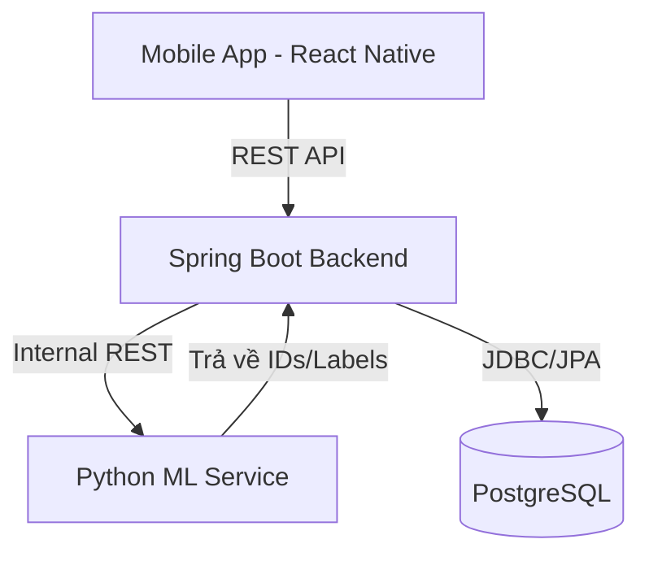

# MixiCook Backend Design Report

Bản báo cáo chi tiết về thiết kế kiến trúc hệ thống và cơ sở dữ liệu cho ứng dụng MixiCook.

## 1. Công nghệ sử dụng (Tech Stack)
- **Main Backend:** Java 17, Spring Boot 3.5.13.
- **Database:** PostgreSQL.
- **ML Search Service:** Python (FastAPI/Flask).
- **Giao tiếp:** REST API (Synchronous - Hybrid approach).
- **Xác thực:** JWT (JSON Web Token).

## 2. Kiến trúc Hệ thống (System Architecture)

Hệ thống được thiết kế theo mô hình Microservices đơn giản, tập trung vào khả năng tích hợp linh hoạt giữa Java và Python.

### Luồng xử lý tìm kiếm theo nguyên liệu:
1. **Mobile App:** Người dùng chọn danh sách nguyên liệu từ `IngredientPickerScreen`.
2. **Spring Boot:** Nhận mảng `ingredient_ids`, thực hiện xác thực và gọi đến `ML Search Service`.
3. **Python Service:** Nhận đầu vào, đưa vào model học máy để tính toán độ tương đồng/phù hợp và trả về một danh sách các `recipe_ids`.
4. **Spring Boot:** Dùng danh sách `recipe_ids` nhận được để query thông tin chi tiết (tên, ảnh, mô tả) từ PostgreSQL và trả về cho Mobile.

## 3. Thiết kế Cơ sở dữ liệu (Database Schema)

Hệ thống sử dụng PostgreSQL với các thực thể chính sau:

### Bảng `users`
Lưu trữ thông tin người dùng và phân quyền.
- `id` (UUID, PK)
- `username` (Varchar, Unique)
- `password` (Varchar)
- `email` (Varchar, Unique)
- `avatar_url` (Text)
- `created_at` (Timestamp)

### Bảng `ingredients` (Hệ thống quản lý)
Danh mục nguyên liệu chuẩn của hệ thống để người dùng chọn.
- `id` (Long, PK)
- `name` (Varchar, Unique)
- `category` (Varchar): Rau củ, thịt, gia vị...
- `image_url` (Text)

### Bảng `recipes`
Lưu trữ công thức nấu ăn. Bao gồm cả dữ liệu mẫu của hệ thống và dữ liệu người dùng đóng góp.
- `id` (Long, PK)
- `title` (Varchar)
- `description` (Text)
- `instructions` (Text/JSON): Các bước thực hiện.
- `image_url` (Text)
- `cooking_time` (Integer): Phút.
- `difficulty` (Enum): Easy, Medium, Hard.
- `user_id` (UUID, FK): Null nếu là công thức mặc định của hệ thống.
- `is_system` (Boolean): Đánh dấu công thức gốc.
- `created_at` (Timestamp)

### Bảng `recipe_ingredients` (Mapping)
Liên kết nguyên liệu vào công thức.
- `recipe_id` (Long, FK)
- `ingredient_id` (Long, FK)
- `amount` (Float): Số lượng.
- `unit` (Varchar): gram, cái, thìa...

### Bảng `saved_recipes` (Mới)
Lưu trữ danh sách công thức người dùng đã lưu (Favorites).
- `id` (Long, PK)
- `user_id` (UUID, FK)
- `recipe_id` (Long, FK)
- `saved_at` (Timestamp)
- *Constraint:* Unique(user_id, recipe_id) để tránh lưu trùng lặp.

## 4. Giao tiếp API (Core Endpoints)

### Spring Boot Endpoints:
- `POST /api/v1/auth/login`: Đăng nhập.
- `GET /api/v1/ingredients`: Lấy danh sách nguyên liệu hệ thống.
- `POST /api/v1/recipes`: Người dùng đăng công thức mới.
- `POST /api/v1/search/by-ingredients`: API nhận danh sách nguyên liệu và phối hợp với Python để trả kết quả.
- `GET /api/v1/recipes/saved`: Lấy danh sách công thức đã lưu của người dùng hiện tại.
- `POST /api/v1/recipes/{id}/save`: Lưu/Bỏ lưu công thức.

### Python ML Endpoints:
- `POST /internal/predict`: Nhận `{ "ingredients": [id1, id2...] }`, trả về `{ "recommended_recipes": [rid1, rid2...] }`.

## 5. Nhật ký quyết định (Decision Log)

| Vấn đề | Quyết định | Lý do |
| :--- | :--- | :--- |
| Phiên bản Framework | Spring Boot 3.5.13 | Sử dụng bản cập nhật hiện đại nhất năm 2026. |
| Quản lý nguyên liệu | Transient (không lưu DB khi chọn) | Tối ưu hóa Database, chỉ quản lý trạng thái tại Mobile cho đến khi tìm kiếm. |
| Cơ chế đóng góp | Pick từ nguyên liệu hệ thống | Đảm bảo dữ liệu nguyên liệu đồng nhất cho model ML, tránh việc người dùng nhập sai tên nguyên liệu. |
| Mô hình ML | Hybrid (Engine only) | Tách biệt rạch ròi: Python xử lý toán học, Java xử lý dữ liệu và nghiệp vụ. |
| Công thức đã lưu | Danh sách phẳng (Option A) | Đơn giản hóa trải nghiệm người dùng và Database trong giai đoạn quy mô nhỏ/vừa. |

---
*Báo cáo được cập nhật bởi Gemini CLI Agent - 23/04/2026*
